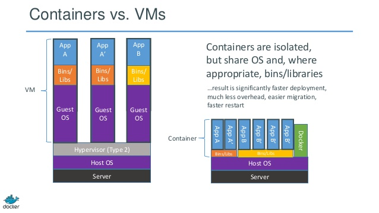

### Android Development Environment

### using Docker

---

### What is Docker?


---

### What is Docker?

- software container platform
- open source project |
- can be seen as a lightweight Virtual Machine |
- build once, run anywhere, regardless of host distro and kernel version |
- based on Linux kernel features like cgroups and namespaces to isolate |
- previously used LXC, now libcontainer |

---

### Container vs Virtual Machine



---

### Docker workflow


---

### Basic example of Docker

**`docker run -i -t ubuntu bash`**

- downloads an ubuntu image (if needed)
- launches an interactive container running bash
- run `ps aux` in container - only bash is there

---

### Docker commands

- **`docker images`**   # List the images on your system
- **`docker run`**      # Run an image
- **`docker ps`**       # List the running containers
- **`docker build`**    # Build an image from a Dockerfile
- **`docker rmi`**      # Delete an image

---

### Why use Docker for development environment?

- one defined environment
- everyone use the same environment |
- useful in long run when new versions of tools/packages appear |
- fast with minimal overhead |
- installation of environment is scripted or pre-built |
- same environment can be used by e.g. Jenkins |
- environment can be automatically verified to e.g. build AOSP |
- run multiple versions |

---

### So, what is included in this image?

- prerequisites for building AOSP, incl `repo`
- Android Studio
- SDK, build tools, NDK, emulator image
- Visual Studio Code
- lldb

---

### Prerequisite - install docker engine

- Package `docker-engine`, add key and repo
- Scripts requires specific version 1.13.1
- `android_docker/install-docker.sh`

---

### Build a Docker image

- *`Dockerfile`* is the recipe/script
- `android_docker/build.sh` - wrapper with useful options

---

### Dockerfile

```bash
FROM ubuntu:16.04
RUN apt-get update

RUN apt-get install -y openjdk-8-jdk

#...

# Download specific Android Studio bundle (all packages).
RUN curl -L https://dl.google.com/dl/android/studio/ide-zips/2.3.2.0/android-studio-ide-162.3934792-linux.zip \
    --output /tmp/studio.zip \
    && unzip -d /opt/android /tmp/studio.zip \
    && rm /tmp/studio.zip

#...

```

---

### Run a Docker image

- `docker run [options] <image-name>`
- `android_docker/run.sh` - wrapper with lots of options, like mounting points, X11 and user id
- `adk` - bash function to run container from any directory (`source bash_aliases_adk`)

---

### Examples

- `adk bash` - to start an interactive shell and e.g. build AOSP
- `adk studio` - start Android Studio
- `adk code` - start Visual Studio Code

---

### Caveats

*NOTE:* The --rm flag is used. Docker will discard any changes to the
filesystem(*) inside the container. Always get a clean start.

---

### What files should be shared between container and host?

- `/home/adk` - is a mounted anonymous 'Docker volume' mounted as HOME in container
- `/home/<user>` - by default, the user's HOME directory on host

allows for persistent changes like IDE settings and build artifacts

`adk -c studio` - will clean the docker volume

---

### User and group ID

The `run.sh` script etc will configure a user in the container with the same
user id and group id as your user on host.

--> any created file in container is owned by user

---

### Entrypoint

- Container typically runs one command
- we use

### Cool, where do I start

Gerrit: http://10.236.95.21:8080/

Project: android_docker

android_docker/README.md

---

### Questions?

