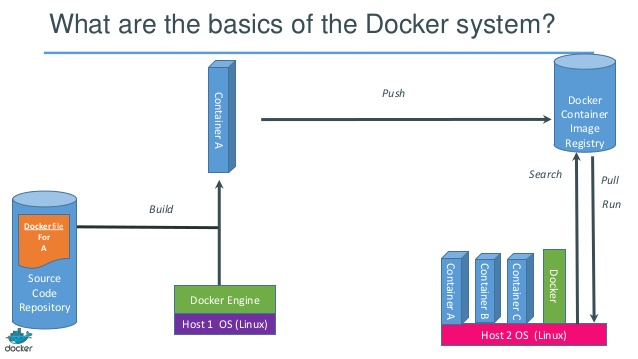

### Android Development Environment

### using Docker

---

### What is Docker


+++

- software container platform
- can be seen as a lightweight Virtual Machine |
- automates the task of setting up and configuring development environment |
- build once, run anywhere, regardless of host distro and kernel version |
- lightweight - an isolated process, not a virtual machine |
- uses Linux kernel features like cgroups and namespaces to isolate |
- previously based on LXC, but now uses libcontainer |
- container is an instance of an image running as isolated process |

---



---

### Basic example of Docker

**`docker run -i -t ubuntu bash`**

- downloads an ubuntu image (if needed)
- launches an interactive container running bash
- run `ps aux` in container - only bash is there

---

### Docker commands

- **`docker build`**    # Build an image from a Dockerfile
- **`docker images`**   # List the images on your system
- **`docker run`**      # Run an image
- **`docker ps`**       # List the running containers
- **`docker rmi`**      # Delete an image

---

### Why use Docker for development environment

- one defined environment
- everyone use the same environment |
- useful in long run when new versions of tools/packages appear |
- environment can be automatically verified to e.g. build AOSP |
- same environment can be used by e.g. Jenkins |

---

### Prerequisite - install docker engine

- Package `docker-engine`, add key and repo
- Scripts requires specific version 1.13.1
- `android_docker/install-docker.sh`

---

### Build a Docker image

- *`Dockerfile`* is the recipe/script
- `android_docker/build.sh` - wrapper with useful options

---

### Dockerfile

```bash
FROM ubuntu:16.04
RUN apt-get update

RUN apt-get install -y openjdk-8-jdk

#...

# Download specific Android Studio bundle (all packages).
RUN curl -L https://dl.google.com/dl/android/studio/ide-zips/2.3.2.0/android-studio-ide-162.3934792-linux.zip --output /tmp/studio.zip \
    && unzip -d /opt/android /tmp/studio.zip \
    && rm /tmp/studio.zip

#...

```

---

### Run a Docker image

- `docker run [options] <image-name>`
- `android_docker/run.sh` - wrapper with lots of options, like mounting points, X11 and user id
- `adk` - bash function to run container from any directory (`source bash_aliases_adk`)

+++

### Examples

- `adk bash` - to start an interactive shell and e.g. build AOSP
- `adk studio` - start a Android Studio
- `adk code` - or Visual Studio Coden

---

### Caveats

*NOTE:* The --rm flag is used. Docker will discard any changes to the
filesystem(*) inside the container. Always get a clean start.

---

### What files should be shared between container and host?

- `/home/adk` - is a mounted anonymous 'Docker volume'
- `/home/<user>` - by default, the user's HOME directory

allows for persistent changes like IDE settings and build artifacts

---

## User and group ID

The `run.sh` script etc will configure a user in the container with the same
user id and group id as your user on host.

--> any created file in container is owned by user

---

## Questions?

